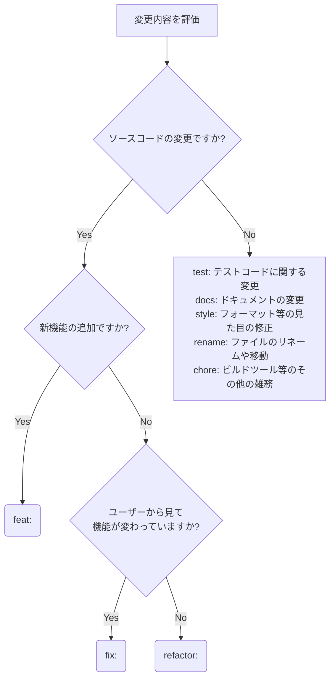

# Terminology
本ドキュメントにおける制約レベルを示すキーワードは、RFC 2119に準拠し、以下の通り厳格に解釈してください。

- **【MUST】**：いかなる例外も許されず、必ず実行・遵守しなければなりません。この規約を守らないことは重大な規約違反とみなされます。
- **【MUST NOT】**：いかなる理由や状況であっても、絶対に実行してはなりません。この規約を守らないことは重大な規約違反とみなされます。
- **【SHOULD】**：強く推奨されます。基本的には従う必要がありますが、文脈上やむを得ない、または明確で合理的な理由がある場合のみ、例外として自律的な判断で回避することが許容されます。
- **【SHOULD NOT】**：強く非推奨とされます。基本的には避けるべきですが、他に適切な回避策がない特別な事情がある場合のみ、実行することが許容されます。
- **【MAY】**：任意（オプション）です。実行してもよいし、しなくてもかまいません。状況に合わせて最適な選択を自律的に判断してください。

# Goal
チームの規約に従った構造化されたコミットメッセージを作成し、安全かつ追跡可能なローカルのバージョン管理操作を実行すること。

# Instructions & Constraints

## 1. 事前確認とブランチ運用
- 【MUST】変更をコミットする前には、必ず `git status` および `git diff` を実行し、意図した変更のみが含まれていることを確認すること
- 【MUST】新規作業を始める際は、現在のブランチを確認し、必要に応じて用途に合ったブランチ（例: `feature/xxx`, `fix/xxx`, `chore/xxx`）を新しく作成して切り替えること。ただし、チケット駆動開発の場合は、`[チケット名]-[機能名]`（`[issue-123]-[feature-name]`など）の形式でブランチ名を作成し、切り替えること。 このとき、ブランチ名の命名規則はプロジェクトで統一すること。
- 【MUST NOT】`main`, `master`, `develop` などの主要な保護ブランチ（デフォルトブランチ）に直接コミットしないこと

## 2. コミットの粒度とステージング
- 【MUST】1つのコミットには1つの論理的な変更（アトミックな変更）のみを含めること
- 【MUST】ファイル名の変更（リネーム）と、そのファイルの内容の変更を行う場合は、Gitの履歴追跡を維持するために必ず別々のコミットに分けること。先に「ファイル名変更のみのコミット（`git mv`等）」を行い、その後に「内容変更のコミット」を行う手順を厳守してください。
- 【MUST NOT】変更の意図を確認せずに `git add .` や `git commit -a` を使用して、無関係な変更をすべてまとめてコミットしないこと
- 【SHOULD NOT】コンパイルエラーやテストが通らない状態のソースコードをコミットしないこと（一時的な退避の場合は `git stash` を使用すること）

## 3. コミットメッセージの規約

### コミットプレフィックス決定フロー
- 【MUST】コミットのプレフィックスを決定する際、以下のフローチャート（Mermaid図）を参照し、変更内容に最も合致する型を一意に選択すること。

### 規約ルール
- 【MUST】コミットメッセージのタイトルは、上記のフローで決定したプレフィックスから始めること。
- 【MUST】コミットメッセージのタイトルは、変更内容がひと目で分かるように具体的に記述すること（例：`fix: バグ修正` といった曖昧なメッセージにしないこと）。
- 【MUST】プレフィックスに `fix:` を選択した場合は、必ずコミットメッセージの空行を挟んだ本文（ボディ）に、「なぜ修正するのか（修正の目的・背景）」および「対応内容（どのように修正したか）」を記述すること。
- 【SHOULD】`fix:` 以外の場合でも、変更の「理由」や「背景」がタイトルだけで伝わらない場合は、本文（ボディ）に変更の目的を記述すること。
- 【MAY】コミットメッセージの末尾に、関連するIssue番号やチケットID（例: `#123`）を付与すること。

## 4. プッシュとリモート操作の提案
- 【MUST NOT】エージェント自身でリモートリポジトリへのプッシュ（`git push`等）を実行しないこと。
