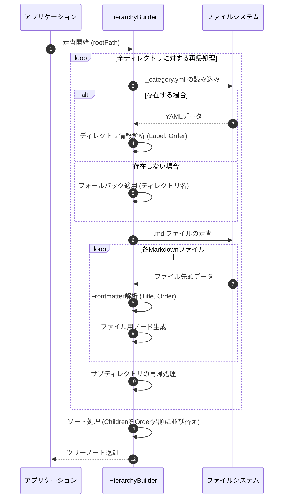

# 目的
Gitサブモジュールとして管理されるドキュメントリポジトリをGoアプリケーションで読み込み、階層ツリーを構築する。ディレクトリは `_category.yml`、Markdownファイルは先頭の `Frontmatter` を解釈し、表示名と順序が最適化されたドキュメントツリーを構築・キャッシュするロジックとテスト要件を明確化すること。

# 詳細ロジック

## データ型のシグネチャ定義
```go
// ディレクトリ用のメタデータ (_category.yml)
type CategoryMeta struct {
    Label string `yaml:"label"`
    Order int    `yaml:"order"`
}

// ファイル用のメタデータ (Markdown Frontmatter)
type FrontmatterMeta struct {
    Title string `yaml:"title"`
    Order int    `yaml:"order"`
}

// ドキュメント階層を表すツリー構造
type DocumentNode struct {
    Path        string
    URLPath     string
    DisplayName string
    Order       int
    IsDirectory bool
    Children    []*DocumentNode
}

// 階層構築インターフェース
type HierarchyBuilder interface {
    BuildTree(ctx context.Context, rootPath string) (*DocumentNode, error)
}
```

## 階層ツリー構築処理フロー
1. **走査開始:** `HierarchyBuilder` が指定されたルートディレクトリの走査を開始する。
2. **ディレクトリ情報の取得と解析:** カレントディレクトリ内に `_category.yml` が存在するか確認し、存在する場合はYAMLを解析して表示名（Label）と順序（Order）を取得する。存在しない場合はディレクトリ名を仮の表示名とし、順序をデフォルト値（最下位）とする。
3. **ファイル情報の取得と解析:** 同ディレクトリ内のMarkdown（`.md`）ファイルを走査する。各ファイルの先頭部分を読み込み、Frontmatterを解析して記事のタイトル（Title）と順序（Order）を取得する。
4. **ファイル用ノードの生成:** 解析したFrontmatterの情報を基に、各ファイルの `DocumentNode` を生成し、親ディレクトリの子ノードリスト（Children）に追加する。
5. **サブディレクトリの再帰処理:** サブディレクトリが存在する場合、ステップ2〜4の処理を再帰的に実行し、生成されたディレクトリ用ノードを子ノードリストに追加する。
6. **ソート処理:** ディレクトリ内の全ての走査が完了した後、子ノードリスト（ファイルとサブディレクトリの混在）を `Order` の昇順でソートする。
7. **完了と返却:** 全ての再帰処理が完了後、構築されたルートノードを返却（キャッシュ）する。



# テスト設計

## 正常系（Happy Path）
*   **メタデータとFrontmatterを含む階層の正常構築**
    *   **前提条件（Given）:** `_category.yml` と、Frontmatterが記述された `.md` ファイルを含むディレクトリ構造が存在する。
    *   **実行操作（When）:** `BuildTree` を実行する。
    *   **期待される結果（Then）:** ディレクトリおよびファイルがそれぞれのメタデータ設定通りに命名され、同一階層内で `Order` に従って正しくソートされたツリーが返却されること。

## 異常系（エラーハンドリング）
*   **Frontmatterが存在しないMarkdownファイルの処理**
    *   **前提条件（Given）:** Frontmatterが記述されていない `.md` ファイルが存在する。
    *   **実行操作（When）:** `BuildTree` を実行する。
    *   **期待される結果（Then）:** ファイル名（拡張子を除いたもの）が `DisplayName` にフォールバックされ、順序はデフォルト値（最後尾）として処理されること。
*   **YAML構文エラー時のフォールバック**
    *   **前提条件（Given）:** `_category.yml` またはファイルのFrontmatterのYAML構文が不正である。
    *   **実行操作（When）:** `BuildTree` を実行する。
    *   **期待される結果（Then）:** パースエラーがログ出力され、システムはクラッシュせずにメタデータ非存在時と同様のフォールバック動作が適用されること。
*   **アクセス権限不足のスキップ処理**
    *   **前提条件（Given）:** 読み取り権限のないディレクトリまたはファイルが含まれている。
    *   **実行操作（When）:** `BuildTree` を実行する。
    *   **期待される結果（Then）:** 対象のパスで権限エラーが記録され、そのノードのみスキップ（無視）された状態で残りのツリーが正常に構築されること。

## パフォーマンステスト・境界値テスト
*   **大量ファイルと深いネストの処理**
    *   **前提条件（Given）:** 階層の深さが100以上、かつ各階層に数百のファイルが存在し、総計10,000ファイルを超えるモック環境が存在する。
    *   **実行操作（When）:** `BuildTree` を実行する。
    *   **期待される結果（Then）:** メモリ枯渇やスタックオーバーフローを起こさず、許容時間内（例: 5秒以内）に全ファイルのFrontmatter解析とツリー構築が完了すること。