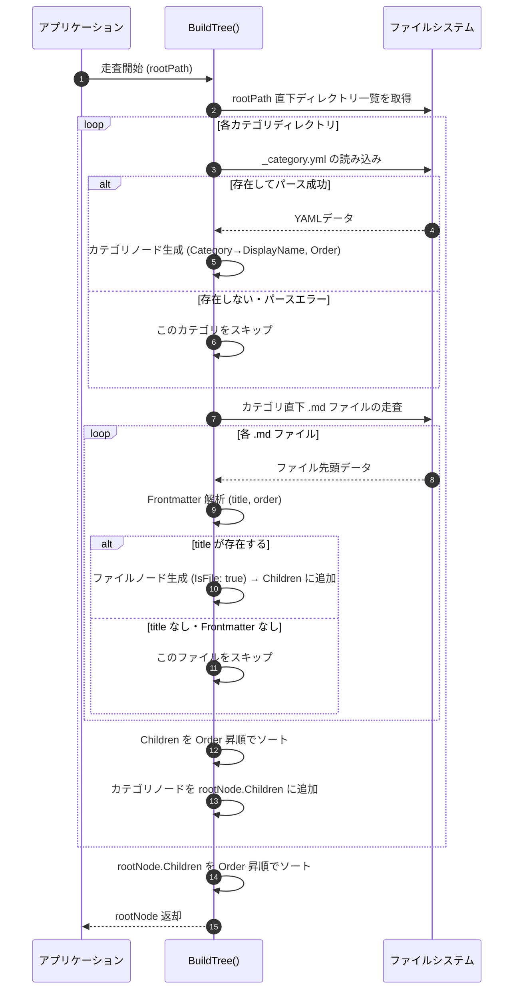

# 目的
Gitサブモジュールとして管理されるドキュメントリポジトリをGoアプリケーションで読み込み、階層ツリーを構築する。ディレクトリは `_category.yml`、Markdownファイルは先頭の `Frontmatter` を解釈し、表示名と順序が最適化されたドキュメントツリーを構築・キャッシュするロジックとテスト要件を明確化すること。

# 詳細ロジック

## データ型のシグネチャ定義
```go
// ディレクトリ用のメタデータ (_category.yml)
// yaml キーは "label" / "order"
type CategoryMeta struct {
    Category string `yaml:"label"`
    Order    int    `yaml:"order"`
}

// ファイル用のメタデータ (Markdown Frontmatter)
type FrontmatterMeta struct {
    Title string `yaml:"title"`
    Order int    `yaml:"order"`
}

// ドキュメント階層を表すツリー構造（JSON として API レスポンスに含まれる）
type DocumentNode struct {
    DisplayName string          `json:"displayName"`
    URLPath     string          `json:"urlPath"`
    Path        string          `json:"-"`       // サーバー内部用、JSONに含めない
    Order       int             `json:"order"`
    IsFile      bool            `json:"isFile"`  // true = ファイルノード、false = カテゴリノード
    Children    []*DocumentNode `json:"children"`
}

// 検索結果
type SearchResult struct {
    URLPath     string `json:"urlPath"`
    DisplayName string `json:"displayName"`
    Snippet     string `json:"snippet"`
}
```

## 階層ツリー構築処理フロー

`BuildTree(rootPath string)` 関数が以下のフローでツリーを構築する。  
**ツリーの深さは2階層固定**（`rootPath` 直下のカテゴリディレクトリ → その直下の `.md` ファイル）であり、サブディレクトリへの再帰は行わない。

1. **走査開始:** 指定されたルートディレクトリ（`rootPath`）の直下ディレクトリ一覧を取得する。
2. **カテゴリ情報の取得と解析:** 各サブディレクトリに `_category.yml` が存在するか確認する。
   - **存在する場合:** YAMLを解析して表示名（`Category` フィールド = `label` キー）と順序（`Order`）を取得する。
   - **存在しない・パースエラーの場合:** そのカテゴリディレクトリ全体をスキップ（ツリーに含めない）する。
3. **ファイル情報の取得と解析:** カテゴリディレクトリ直下の `.md` ファイルを走査する。各ファイルの先頭を読み込み、Frontmatter（`---` で囲まれたYAMLブロック）を解析して `title` と `order` を取得する。
4. **ファイル用ノードの生成と条件:** Frontmatter が存在し `title` が空でないファイルのみ `DocumentNode`（`IsFile: true`）を生成して親カテゴリの `Children` に追加する。Frontmatter がない・`title` が空のファイルは**スキップ**する。
5. **サブディレクトリのスキップ:** カテゴリ直下のサブディレクトリはツリーに含めない（第二階層固定）。
6. **ソート処理:** カテゴリ内のファイルノード全走査後、`Children` を `Order` 昇順でソートする（`cmp.Compare` を使用）。カテゴリノード自体も全走査後に同様にソートする。
7. **完了と返却:** 構築されたルートノードを返却する。キャッシュは呼び出し元（`cache.go`）が管理する。


```mermaid
sequenceDiagram
    autonumber
    participant App as アプリケーション
    participant BuildTree as BuildTree()
    participant FS as ファイルシステム

    App->>BuildTree: 走査開始 (rootPath)
    BuildTree->>FS: rootPath 直下ディレクトリ一覧を取得

    loop 各カテゴリディレクトリ
        BuildTree->>FS: _category.yml の読み込み
        alt 存在してパース成功
            FS-->>BuildTree: YAMLデータ
            BuildTree->>BuildTree: カテゴリノード生成 (Category→DisplayName, Order)
        else 存在しない・パースエラー
            BuildTree->>BuildTree: このカテゴリをスキップ
        end

        BuildTree->>FS: カテゴリ直下 .md ファイルの走査
        loop 各 .md ファイル
            FS-->>BuildTree: ファイル先頭データ
            BuildTree->>BuildTree: Frontmatter 解析 (title, order)
            alt title が存在する
                BuildTree->>BuildTree: ファイルノード生成 (IsFile: true) → Children に追加
            else title なし・Frontmatter なし
                BuildTree->>BuildTree: このファイルをスキップ
            end
        end

        BuildTree->>BuildTree: Children を Order 昇順でソート
        BuildTree->>BuildTree: カテゴリノードを rootNode.Children に追加
    end

    BuildTree->>BuildTree: rootNode.Children を Order 昇順でソート
    BuildTree-->>App: rootNode 返却
```

# テスト設計

## 正常系（Happy Path）
*   **メタデータとFrontmatterを含む階層の正常構築**
    *   **前提条件（Given）:** `_category.yml`（`label` / `order` キー）と、Frontmatter（`title` / `order`）が記述された `.md` ファイルを含むディレクトリ構造が存在する。
    *   **実行操作（When）:** `BuildTree` を実行する。
    *   **期待される結果（Then）:** ディレクトリおよびファイルがそれぞれのメタデータ設定通りに命名され、同一階層内で `Order` に従って正しくソートされたツリーが返却されること。

## 異常系（エラーハンドリング）
*   **Frontmatterが存在しない・`title` が空のMarkdownファイルの処理**
    *   **前提条件（Given）:** Frontmatterが記述されていない、または `title` が空の `.md` ファイルが存在する。
    *   **実行操作（When）:** `BuildTree` を実行する。
    *   **期待される結果（Then）:** 該当ファイルはツリーに含まれずスキップされること。他のファイルのツリー構築は正常に完了すること。
*   **`_category.yml` が存在しない・YAML構文エラー時のスキップ**
    *   **前提条件（Given）:** `_category.yml` が存在しない、またはYAML構文が不正なカテゴリディレクトリが存在する。
    *   **実行操作（When）:** `BuildTree` を実行する。
    *   **期待される結果（Then）:** 該当カテゴリディレクトリはツリーに含まれずスキップされること。他のカテゴリのツリー構築は正常に完了すること。
*   **カテゴリ直下のサブディレクトリのスキップ処理**
    *   **前提条件（Given）:** カテゴリディレクトリ直下にサブディレクトリが存在する。
    *   **実行操作（When）:** `BuildTree` を実行する。
    *   **期待される結果（Then）:** サブディレクトリはツリーに含まれず無視されること。

## パフォーマンステスト・境界値テスト
*   **大量ファイルの処理**
    *   **前提条件（Given）:** 多数のカテゴリと各カテゴリに数百の `.md` ファイルが存在するモック環境が存在する。
    *   **実行操作（When）:** `BuildTree` を実行する。
    *   **期待される結果（Then）:** メモリ枯渇を起こさず、許容時間内に全ファイルのFrontmatter解析とツリー構築が完了すること。